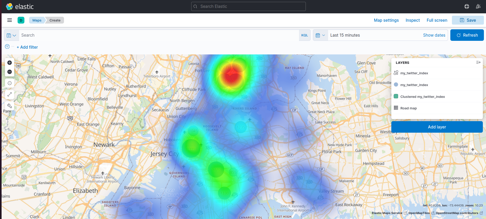
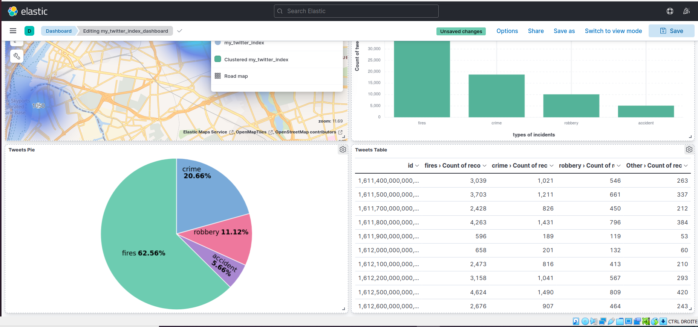

<h1 text-align="center">
  <br>
    Real time processing of spatio-temporal twitter data related to traffic alerts in NewYork City
</h1>
<div text-align="center">
  <h4>
    <a href="#overview">Overview</a> |
    <a href="#prerequisites">Prerequisites</a> |
    <a href="#how-to-run">How to run</a> |
    <a href="#data-preprocessing">Data preprocessing</a> |
    <a href="#spark-ml-pipeline">Spark ML pipeline</a> |
  </h4>
</div>
<br>

## Overview
This project consists of a Kibana dashboard for sentiment analysis of road alerts in NewYork city scrapped from twitter.
The project sets up a complete pipeline for data collection, streaming, ML model training and classification, indexing and visualization.





## Prerequisites

In order to be able to reproduce this project, the following software should be installed:
- Spark (spark-3.2.0-bin-hadoop3.2)
- Kafka (kafka_2.12-3.2.0)
- ElasticSearch (elasticsearch-7.14.1)
- Kibana (kibana-7.14.1)

Also, you must have valid twitter API credentials.


## How to run
### Start required services
Here $PATH stands for the directory where each of the required services is installed.

1. Start ElasticSearch
``` shell
cd $PATH
./bin/elasticSearch
```
2. Start Kibana
``` shell
cd $PATH
./bin/kibana
```

3. start zookeeper
``` shell
cd $PATH
bin/zookeeper-server-start.sh config/zookeeper.properties
```
4. start kafka
``` shell
bin/kafka-server-start.sh config/server.properties
```

### Execute python files

1. install requirements
```shell
pip install -r requirements.txt
```
1. producer.py  (to launch search and tweet extraction)
``` shell
python3 Twitter_KafkaProducer.py 
```

2. Submit training (train spark model)
``` shell
cd PATH_TO_SPARK
./bin/spark-submit --packages org.apache.spark:spark-sql-kafka-0-10_2.12:3.2.0,org.elasticsearch:elasticsearch-spark-30_2.12:7.14.1 PROJECT_DIRECTORY/Twitter_LR_Training_model.py --dataset=PROJECT_DIRECTORY/training_set.csv
```
3. Submit consumer (Classification and pushing to elascticSearch)
``` shell
cd PATH_TO_SPARK
./bin/spark-submit --packages org.apache.spark:spark-sql-kafka-0-10_2.12:3.2.0,org.elasticsearch:elasticsearch-spark-30_2.12:7.14.1 PROJECT_DIRECTORY/Twitter_index_to_ES.py
```
### Launch dashboard
1. Open http://localhost:5601/ in your browser.
2. Go to Management>Kibana>Saved Objects
3. Open dashboard

## Data preprocessing
Before performing sentiment analysis, the scrapped tweets undergo a cleaning process:
- Filter out retweets, mentions and hashtags.
- Filter out tweets containing only screen name.
- Remove links, emojis and irrelevant tags.
- Keep only tweets written in english.

## Spark ML pipeline
The Spark ML pipeline consists of 5 stages
1. Tokenizer
2. Stop words remover
3. Hashing TF
4. IDF
5. Logistic regression model

The model is then trained on a [dataset](dataset/training_set.csv) containing tweets from New york city 911 twitter account and classified to four categories of incidents : fires, Accidents, Crimes and Robbery. 


